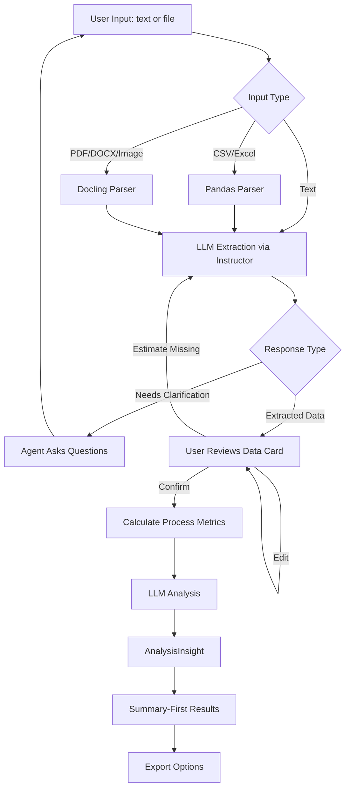
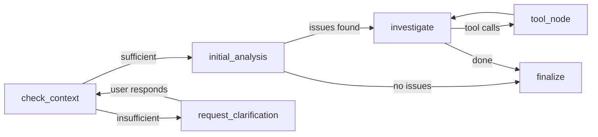

# ProcessIQ

AI-powered process optimization advisor that understands business context — not just data.


---

## Overview

ProcessIQ is a high-CQ (Context Quotient) AI agent that analyzes business processes, identifies genuine bottlenecks, and generates constraint-aware recommendations with assumption-driven ROI estimates.

Unlike generic LLM tools, ProcessIQ:

- Distinguishes waste from core value work
- Respects real-world constraints (budget, hiring freezes, regulation)
- Makes confidence-driven decisions, asking for clarification when it needs more data
- Explains assumptions transparently — no false precision
- Calibrates recommendations to business size (a bakery gets different advice than an enterprise)

---

## Demo


<details>
<summary><strong>Core Flow</strong></summary>

<br>

**Start screen**


On first load, a capability overview explains what ProcessIQ does before any conversation starts.

**1. Describe a process in plain language**


The agent extracts structured steps from natural language. If critical data is missing, it asks targeted questions instead of guessing.

**2. Review and edit extracted data**


Extracted steps appear in an inline editable table. Every inferred value is marked with `*`. You can adjust any cell before proceeding.

**3. Results and feedback**


Results are structured as issues → linked recommendations. Each recommendation includes a rough ROI estimate and implementation details behind progressive disclosure. Feedback buttons appear directly below each recommendation.

</details>

---

## Problem Statement

Most process optimization tools either:

- Require structured event logs (enterprise systems)
- Provide generic LLM suggestions with no constraint awareness
- Ignore operational reality (budget, headcount, regulations)
- Present unrealistic ROI precision

ProcessIQ bridges this gap by combining deterministic metric calculation with structured LLM judgment inside a stateful agent architecture.

---

## Why an Agent?

If a system must make judgment calls rather than execute a fixed sequence of steps, an agent architecture is justified.

ProcessIQ requires agentic behavior because it must:

1. Evaluate whether sufficient context exists before proceeding
2. Decide when to ask clarifying questions instead of guessing
3. Interpret patterns beyond deterministic metrics (waste vs. core value)
4. Resolve constraint conflicts (cannot hire + hire 2 people = contradiction)
5. Decide which issues warrant deeper investigation — and how to frame each investigation
6. Stop investigating when enough evidence has been gathered

### Agent Type: Utility-Based Agent

ProcessIQ optimizes competing objectives:

- Cost vs. time vs. quality
- Regulatory constraints
- User-defined priorities

It evaluates utility (ROI weighted by confidence and constraints) and generates recommendations that maximize value under realistic conditions.

---

## Core Design Principle

**Algorithms calculate facts. The LLM makes judgments.**

| Component | Source | Deterministic |
|-----------|--------|---------------|
| Process metrics (% of total time, cycle time) | Algorithm | Yes |
| ROI calculations (pessimistic/likely/optimistic) | Algorithm | Yes |
| Confidence scoring (data completeness) | Algorithm | Yes |
| Waste vs. core value assessment | LLM | No |
| Root cause reasoning | LLM | No |
| Recommendation generation | LLM | No |

This separation ensures transparency, auditability, and reliability.

---

## Architecture

### High-Level Flow



### LangGraph Agent



| Node | Responsibility |
|------|----------------|
| `check_context` | Evaluate data completeness, decide whether to proceed or ask |
| `request_clarification` | Ask targeted follow-up questions based on data gaps |
| `initial_analysis` | Calculate process metrics + LLM pattern analysis → `AnalysisInsight` |
| `investigate` | LLM with bound tools decides which aspects to investigate deeper |
| `tool_node` | Executes tool calls, appends results to message history, loops back |
| `finalize` | Incorporates investigation findings, packages final `AnalysisInsight` |

The investigation loop uses LangGraph's native `ToolNode` pattern with `InjectedState`. The LLM uses native function calling — it decides which tool to call and crafts specific arguments, rather than selecting from a fixed enum. The loop stops when the LLM makes no further tool calls or the cycle limit is reached.

---

## Context Quotient (CQ)

Agent effectiveness: **Performance = IQ × EQ × CQ**

High-CQ means recommendations adapt to the user's specific business reality.

| Generic Agent | ProcessIQ |
|---------------|-----------|
| "This step is slow" | "This step is slow and blocks 3 downstream tasks" |
| "Automate this" | "Automate this — but given your no-hiring constraint, here's a software-only option" |
| "ROI: $50K" | "ROI: $30K–$70K, confidence 62% — missing error rate data for steps 3–5" |

---

## Feedback Loop

ProcessIQ learns from your reactions within a session. After each recommendation, you can mark it helpful or reject it with an optional reason.

When you re-run analysis (after adding context or constraints), the agent receives your feedback history and:

- **Does not repeat rejected recommendations** — unless it has a fundamentally different approach
- **Leans toward accepted recommendation types** — it calibrates to what you found useful

The feedback is injected directly into the analysis prompt as an explicit instruction to the LLM — not as a vague hint. Rejected items include your reason if you provided one.

**How the pipeline works:**

```
thumbs up / down
    ↓
session_state["recommendation_feedback"]
    ↓
execute_pending_analysis() → analyze_process()
    ↓
_format_feedback_history() → text block
    ↓
analyze.j2 → LLM instruction:
  "Do NOT repeat rejected recommendations.
   Lean toward accepted types."
    ↓
New AnalysisInsight with adjusted recommendations
```

---

## Features

### Chat-First Interface
- Describe processes in plain language or upload files
- Smart interviewer: extracts structured data OR asks clarifying questions — never guesses
- Inline editable data table after extraction
- Draft analysis preview before full confirmation
- Post-analysis follow-up conversation with full context

### Data Ingestion
- CSV and Excel upload with pandas-based parsing
- LLM-powered normalization via Instructor + Pydantic — handles messy, inconsistent data
- Files processed in-memory only, never stored on disk

### Analysis Engine
- Process metrics: cycle time, bottleneck identification, dependency graph
- Waste vs. core value differentiation (LLM judgment, not just "longest = worst")
- Agentic investigation loop: after initial analysis, the LLM uses tool calls to examine dependency impact, validate root cause hypotheses, and check constraint feasibility before finalizing recommendations
- Root cause analysis with explicit reasoning
- ROI ranges: pessimistic / likely / optimistic with stated assumptions
- Confidence scoring based on data completeness

### Results Display
- Summary-first layout: key insight → process flow visualization → main opportunities → core value work
- Interactive process flowchart: nodes colored by severity (bottleneck = red, at-risk = amber, core value = green), sized by share of total time, with dependency edges; Before/After toggle shows impact of top recommendation
- Issues linked directly to recommendations
- Investigation findings: collapsible section showing what the agent examined during the tool-calling loop
- Progressive disclosure: summary → plain explanation → concrete next steps
- Estimated values marked with `*` to distinguish from user-provided data
- Per-recommendation feedback (helpful / not useful + optional rejection reason); feedback is injected into subsequent analyses so the LLM avoids repeating rejected approaches

### Flexibility
- OpenAI / Anthropic / Ollama (local) LLM support
- Per-task model configuration (fast model for extraction, stronger for analysis)
- Analysis mode presets: Cost-Optimized / Balanced / Deep Analysis
- Export: CSV (Jira-compatible), text summary, markdown report

---

## Privacy

- Uploaded files processed in-memory — never written to disk
- Session data in local SQLite (browser-session scoped)
- No persistent document storage
- No training on user data
- Self-hosted LLM option via Ollama for sensitive environments

---

## Project Structure

```
processiq/
├── api/                       # FastAPI backend
│   ├── main.py                # Endpoints: /analyze, /extract, /extract-file, /continue, /graph-schema
│   └── schemas.py             # HTTP request/response models
│
├── frontend/                  # Next.js frontend (TypeScript)
│   ├── app/
│   │   └── page.tsx           # Main page (chat + results layout)
│   ├── components/
│   │   ├── chat/              # ChatInterface, EmptyState
│   │   ├── visualization/     # ProcessGraph (React Flow)
│   │   ├── results/           # ProcessIntelligencePanel
│   │   ├── settings/          # SettingsDrawer (LLM, mode, constraints, profile)
│   │   └── layout/            # Header, LeftRail, ContextStrip
│   └── lib/
│       ├── api.ts             # Typed API client
│       └── types.ts           # TypeScript types mirroring Python models
│
├── src/processiq/             # Python agent package (unchanged by frontend migration)
│   ├── config.py              # pydantic-settings configuration
│   ├── llm.py                 # LLM factory (Anthropic/OpenAI/Ollama)
│   ├── model_presets.py       # Analysis mode presets
│   │
│   ├── agent/                 # LangGraph agent
│   │   ├── state.py           # AgentState (TypedDict)
│   │   ├── nodes.py           # check_context, initial_analysis, investigate, finalize
│   │   ├── edges.py           # Conditional routing
│   │   ├── graph.py           # Graph construction
│   │   ├── tools.py           # Investigation tools (InjectedState, native function calling)
│   │   ├── interface.py       # Clean API for the HTTP layer
│   │   └── context.py         # Conversation context builder
│   │
│   ├── analysis/              # Pure algorithms (no LLM)
│   │   ├── metrics.py         # Process metrics calculation
│   │   ├── roi.py             # ROI with PERT-style ranges
│   │   ├── confidence.py      # Data completeness scoring
│   │   └── visualization.py   # GraphSchema DTO + layout algorithm
│   │
│   ├── ingestion/
│   │   ├── csv_loader.py
│   │   ├── excel_loader.py
│   │   ├── normalizer.py      # LLM extraction via Instructor
│   │   └── docling_parser.py  # Universal document parsing
│   │
│   ├── models/                # Pydantic domain models
│   │   ├── process.py         # ProcessStep, ProcessData
│   │   ├── constraints.py     # Constraints, Priority
│   │   ├── insight.py         # AnalysisInsight, Issue, Recommendation
│   │   └── memory.py          # BusinessProfile (memory-ready)
│   │
│   ├── persistence/
│   │   ├── checkpointer.py    # LangGraph SqliteSaver wrapper
│   │   └── user_store.py      # UUID-based session identity
│   │
│   ├── prompts/               # Jinja2 prompt templates
│   │   ├── system.j2
│   │   ├── extraction.j2
│   │   ├── analyze.j2
│   │   ├── investigation_system.j2
│   │   ├── clarification.j2
│   │   └── improvement_suggestions.j2
│   │
│   └── export/
│       ├── csv_export.py      # Jira-compatible CSV
│       └── summary.py         # Text and markdown reports
│
├── tests/
│   ├── unit/
│   └── integration/
│
└── data/                      # Sample data for testing
    ├── sample_process.csv
    ├── sample_constraints.json
    └── sample_messy.xlsx
```

---

## Technology Stack

| Layer | Technology | Purpose |
|-------|-----------|---------|
| Agent orchestration | LangGraph | Stateful graph with conditional branching |
| LLM providers | OpenAI / Anthropic / Ollama | Analysis, extraction, clarification |
| Structured output | Instructor + Pydantic | Validated LLM responses, auto-retry on failure |
| Document parsing | Docling | PDF, DOCX, PPTX, Excel, HTML, images |
| API backend | FastAPI + uvicorn | HTTP endpoints in front of the agent layer |
| Frontend | Next.js + React Flow | Chat UI, interactive process visualization |
| Styling | Tailwind CSS + shadcn/ui | Design system, component primitives |
| Configuration | pydantic-settings | Type-safe `.env` config |
| Prompt templating | Jinja2 | Separate `.j2` files, no inline strings |
| Observability | LangSmith | Agent traces, token usage, node timing |
| Session persistence | LangGraph SqliteSaver | Conversation checkpointing |

---

## Quick Start

**Backend (FastAPI):**
```bash
git clone https://github.com/SkybrushThriftwood/processIQ.git
cd processiq
uv sync --group dev
cp .env.example .env
# Edit .env — add your OPENAI_API_KEY or ANTHROPIC_API_KEY
uvicorn api.main:app --reload
# API docs: http://localhost:8000/docs
```

**Frontend (Next.js):**
```bash
cd frontend
pnpm install
pnpm dev
# App: http://localhost:3000
```

---

## Development

```bash
# Run tests
uv run pytest

# Run only non-LLM tests (fast, no API calls)
uv run pytest -m "not llm"

# Lint
uv run ruff check src/

# Type check
uv run mypy src/
```

---

## Roadmap

**Phase 2 (active):**
- Process visualization — interactive flowchart with severity-colored nodes and Before/After toggle (complete)
- Frontend migration — FastAPI backend + Next.js/React Flow frontend (complete)
- Persistent memory — cross-session business profile, ChromaDB RAG
- UX improvements — concrete hours/year metrics, visible constraint reasoning
- Testing and CI/CD

**Phase 3:**
- LLM response streaming
- Comparison mode (two process versions side by side)
- Opt-in benchmark comparison against industry data

---

## Data & Privacy

ProcessIQ stores your business profile and analysis history in a local SQLite database to improve recommendations over time. No account is required — data is identified only by a random UUID stored in your browser's localStorage.

**User control:** The settings panel includes a "Reset my data" option that permanently deletes your profile and all analysis history from the database and clears the browser UUID.

**Orphaned data:** If you clear your browser data or switch devices without resetting first, your UUID is lost and the stored data becomes inaccessible (no way to re-associate it without an account system). The settings panel notifies users of this before it happens. A planned improvement is automatic expiry of data inactive for 90+ days.

---

## Limitations

- ROI estimates are assumption-driven, not actuarial
- LLM reasoning quality depends on input completeness
- Not a replacement for professional process consulting

---

## Differentiation

| Enterprise Process Mining | ProcessIQ |
|---------------------------|-----------|
| Requires structured event logs | Works from plain text, files, or any format |
| $100K+ licensing | Open-source |
| Black-box analytics | Transparent assumptions and reasoning |

| Generic LLM Chat | ProcessIQ |
|------------------|-----------|
| Unstructured text output | Validated Pydantic models |
| Generic advice | Constraint-aware, business-calibrated recommendations |
| No confidence tracking | Confidence-driven branching |
| Stateless | Stateful agent with conversation history |

---

## License

MIT
